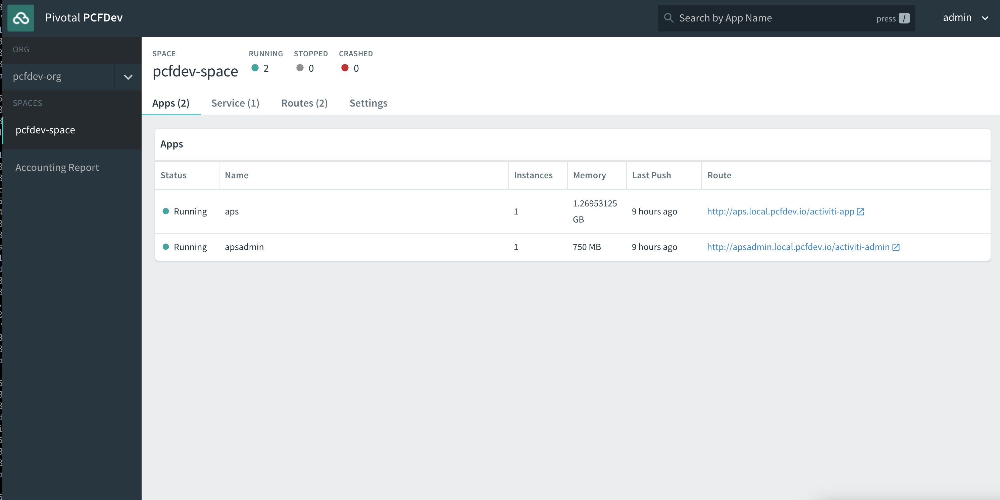
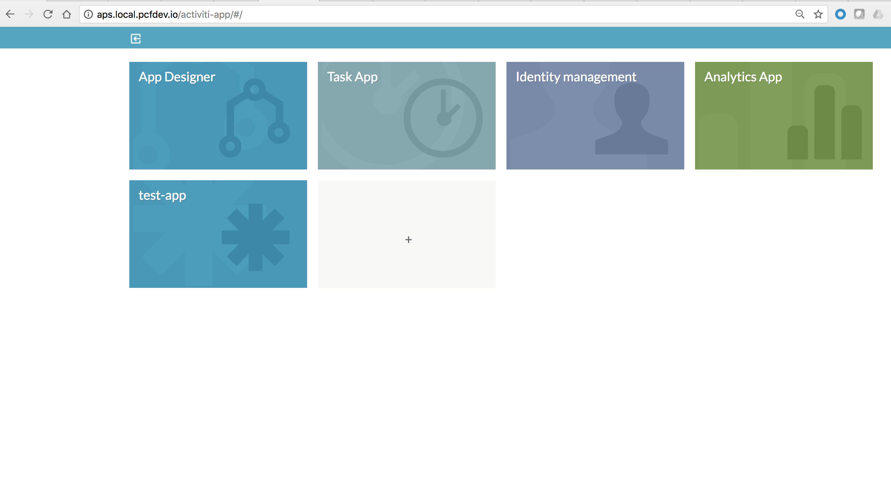
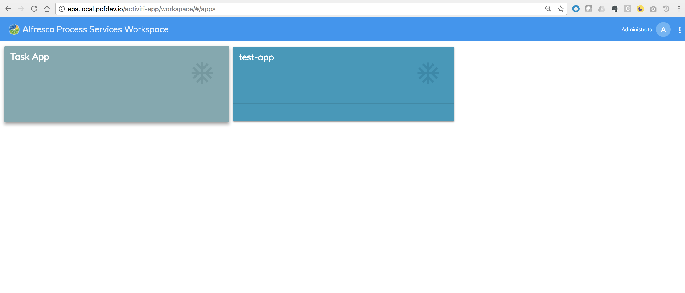

### Deployment of Alfresco Process Services (APS) on Pivotal Cloud Foundry (PCF)
This is an example project showing how to repackage the activiti-app.war of Alfresco Process Services (powered by Activiti) with customer specific libraries, configurations and also with PCF specific configurations. This has been tested with APS v1.8 in a PCF Development environment, specifically PCFDev v0.28.0

### PCFDev Installation & Commands
Install PCFDev by following the instructions in this [page](https://pivotal.io/pcf-dev)
Useful commands to start, stop and destroy an environment are
`cf dev start`
`cf dev stop`
`cf dev destroy` respectively

### Deployment approach
It is worth noting that Alfresco's strategic direction is to support PCF 2.0 and in particular Pivotal Container Service (PKS), which as of this writing has become Generally Available (GA) a few days ago.  The Activiti development team is working on the next generation of Activiti, Activiti 7 and APS 2.0 which is a true [cloud native platform](https://activiti.gitbooks.io/activiti-7-developers-guide/) that runs natively on PKS.  This example project is created to help customers who wish to deploy the current version of APS in their current PCF / PAS environment (previously referred to as the Elastic Runtime). Since APS is packaged & distributed as a war file, the approach here is to repackage the war file with PCF specific configurations making it easy to deploy to PCF.

#### Prerequisites & project set up
* You must have valid license files to run the software. Place the two license files named `Aspose.Total.Java.lic` & `activiti.lic` in `src/main/resources` folder of this project. 
> Important: The names of the files matter, so make sure they are the same as above. Make sure the names are correct!

* You must have access to Alfresco's Enterprise Nexus repository to download the war file & dependencies. Customers are able to request access to the Nexus repository via the Alfresco Customer Portal.
> Important: Please check the pom.xml for the repository configuration and you must have a corresponding configuration in your maven configuration settings.xml

* The war is repackaged using [maven-war-plugin](https://maven.apache.org/plugins/maven-war-plugin/index.html). As explained in the [usage](https://maven.apache.org/plugins/maven-war-plugin/usage.html) page, all customer specific configuration overrides must be placed in the respective folder structure. You can explode the war distribution and explore various configuration files in activiti-app to understand this better. All the configurations are explained in great detail at [APS Admin Guide](https://docs.alfresco.com/process-services1.8/topics/adminGuide.html) as well. 
	* All non-java resources that need to go under `activiti-app/WEB-INF/classes` should be kept in `src/main/resources` inside the required folder structure.  
	* Additional custom java classes can be kept under `src/main/java`.
	* All webapp specific customizations should be kept under `src/main/webapp`. 
	* Additional jar files that need to go under `activiti-app/WEB-INF/lib` can be added to the pom.xml

#### Build the war file
In this project, I am customizing/overriding three files which are `src/main/resources/activiti/whitelisted-scripts.conf`, `log4j.properties`, `META-INF/activiti-app/activiti-app.properties`. You can repackage the war using the command `mvn clean compile war:war`.

#### PCF specific configurations and considerations
Before we go into the deployment steps, let's take a look at some of the PCF specific configuratios and considerations.

###### APS Database Configuration	(activiti-app.properties)
When running in PCF you have a few options to configure the database for APS which are:

* Use a Service from the marketplace (`cf marketplace`) & bind to the app. I have tested this approach by creating a MySQL service in PCFDev & binding APS to the MySQL service and it just works! As far as I understand, a service bound to an app will take precedence over a data source configured via activiti-app.properties
* Create a User-Provided Service Instance (`cf cups`) & configure the data source properties in the activiti-app.properties with attributes from VCAP_SERVICES in the format `${vcap.services.yourservicename.*}`
* Use an External database and configure the environment variables accordingly. In this project I went for this option. Please check the activiti-app.properties file for more details.

###### Event Processing & Elasticsearch Configuration (activiti-app.properties)
Out of the box (OOTB), APS publishes all the analytics data into Elasticsearch. APS v1.8 added a new capability to publish analytics data to a newer version of Elastic using the recommended Java REST Client of Elasticsearch. For more details on this new configuration, please checkout this [blog](https://community.alfresco.com/community/bpm/blog/2018/02/06/alfresco-process-services-18-available-now#jive_content_id_New_Elasticsearch_REST_Client). When running APS on PCF, it is recommended to utilize this feature and publish the events to an external elastic search, should you choose to use the ELK stack. 
> However when you use this new feature, the OOTB Analytics reports no-longer work. Hence it is better to disable it in the configuration using the property. If you are wondering why the analytics module is not updated to work with this new REST client configuration, the future direction is to develop advanced analytics & reporting capabilities in this new module called [Alfresco Search Services & Analytics](https://community.alfresco.com/people/harry.peek@alfresco.com/blog/2017/11/08/alfresco-search-services-analytics-roadmap-update-aw2017).

On running & configuring Elasticsearch itself:
1. Run externally outside PCF and configure activiti-app.properties via a User-Provided Service Instance OR using environment variables attached to APS app.
2. Create & configure to use the service if there is a service available in the marketplace
3. Run in PKS and connect to it.
4. Run externally and use a Service Broker approach

> If you really need Analytics Module in APS when running on PCF, you will need to run the unsupported 1.7.3 Elasticsearch externally and configure the properties file as a `client` as explained in [docs](https://docs.alfresco.com/process-services1.8/topics/elasticsearch_configuration.html). Embedded (Elasticsearch server running embedded within Process Services) is not recommended when running on PCF. 

> If you wish to direct the analytics data to another data source, please read this [page](https://docs.alfresco.com/process-services1.8/topics/process_engine_event_listeners.html) and the PCF configuration itself will depend on your choice!

###### Outbound Email Server Configuration (activiti-app.properties)
For sending outbound emails, APS would require a valid EMail Server configured in the environment. Please refer to the [docs](https://docs.alfresco.com/process-services1.8/topics/emailServerConfiguration.html) for more detail on various email configuration options. I am assuming that your PCF Platform will already have an outbound email server configured for notifications. If this assumption is true & if those properties are available via some services, activiti-app.properties can be mapped using those properties. In this example project, I'm using environment variables.
###### Shared Content Store Configuration (activiti-app.properties)
Alfresco Process Services enables you to upload content, such as attaching a file to a task or a form. This content is stored on a disk and this location must be a shared storage area for the nodes to access the content. As you can see from the properties file, the property `contentstorage.fs.rootFolder` is used to map the shared path. For storing content, APS can be configured either with Amazon S3 OR Shared Storage.

* If it is S3, it can be configured using any S3 services available in PCF Marketplace or by creating a User-Provided Service Instance or via Environment Variables.

* If not using S3 then leverage the NFS Volume Service in PCF and map the storage path accordingly. In this example, I am using the [local-volume](https://github.com/cloudfoundry/local-volume-release) service. You can create local-volume service using the command `cf create-service local-volume free-local-disk contentstore` and use the property `${vcap.services.contentstore.volume_mounts[0].container_dir}` as a value to the property `contentstorage.fs.rootFolder`
###### LDAP Configuration (activiti-ldap.properties)
Similar to activiti-app.properties, LDAP/AD configuration in APS is configured via a property file named `activiti-ldap.properties`. This file will need to be configured using PCF service/environment variables and must be kept at `META-INF/activiti-app/activiti-ldap.properties` of this project. Please refer [External Identity Management (LDAP/Active Directory)](https://docs.alfresco.com/process-services1.8/topics/externalIdentityManagement.html) for more details on this.

###### LDAP Sync (activiti-ldap.properties)
[LDAP Synchronization](https://docs.alfresco.com/process-services1.8/topics/synchronization.html) configuration in Alfresco Process Services is also controlled via `activiti-ldap.properties`. 
> Note that the LDAP sync only needs to be activated and configured on one node in the cluster (eventhough it works when activated on multiple nodes, it is unnecessary). If you are planning to run more than one APS node, it makes sense to generate two war files (one with and one without ldap sync). Using this approach:
> 
>1. You can deploy & run one instance of APS with LDAP Sync turned on. This node can be enabled to do additional async processing such as event processing to Elasticsearch etc
>
>2. If you need additional APS nodes run/scale 1...N instances of APS without LDAP Sync.

Based on my limited knowledge on PCF, a cleaner option will be to deploy APS without LDAP Sync and use the [PCF Scheduler](http://docs.pivotal.io/pcf-scheduler/1-1/using-calls.html) to trigger the LDAP Sync. This approach can help avoid maintaing two apps (one with and one without LDAP Sync). Similar approach can be adopted for the above mentioned Elasticsearch Event Processing as well if you want to restrict it to just one node and save some resources for process execution!

###### External Content Platform integrations(activiti-app.properties)
Content integration to document management platforms such as Alfresco Content Services, Box, or Google Drive can be configured either using a User-Provided Service Instance (`cf cups`) or using environment variables. For the sake of simplicity I excluded those property mappings from the activiti-app.properties in this example. However you can add them in by referring to this [page](https://docs.alfresco.com/process-services1.8/topics/integration_with_external_systems.html). For a complete list of available properties, you can also look at the default activiti-app.properties file which is available in the activiti-app.war distribution from Alfresco.
###### Logging Configuration (log4j.properties)
The log4j.properties file in this example project is configured with standard STDOUT as explained in the [PCF Application Logging docs](https://docs.cloudfoundry.org/devguide/deploy-apps/streaming-logs.html). This will enable the Process Services logging to appear in PCF logs (both via the console as well as using commands such as `cf logs APP_NAME`). While developing solutions & extensions on APS, please ensure that all the logging is implemented via log4j.
###### Tomcat Container Configuration (environment variable)
Alfresco Process Services can be run inside the [Tomcat Container of Cloud Foundry Java Buildpack](https://github.com/cloudfoundry/java-buildpack/blob/master/docs/container-tomcat.md). Since the default context root expected by APS is `/activiti-app`, the environment variable `JBP_CONFIG_TOMCAT` must be set on `cf push`. Check `manifest.yml` for an example environment variable & route path configuration. If you wish to change the default context_path to something else OR leave it as default '/', consider changing the following files.

	```
	activiti-app/scripts/app-cfg.js
	activiti-app/workspace/index.html
	activiti-app/workspace/app.config.json
	activiti-app/workspace/vendor.bundle.js
	```

### Deployment
Let's now look at the deployment of the war file created from this project to different environments using Cloud Foundry Command Line Interface (cf CLI) & Manifests (Manifests provide consistency and reproducibility, and can help you automate deploying apps).Checkout [Deploying with Application Manifests](https://docs.cloudfoundry.org/devguide/deploy-apps/manifest.html) for more details.

Check `manifest.yml` in this project for an example configuration. It is very powerful and if you look at this example, I am doing a lot of configurations such as instance/node count, memory, disk allocation, route config, service binding, environment variables etc
Using this approach, you can create unique manifest files for each of your environment and store them in a version control system such as GitHub

Commands to build the war and deploy the app to PCF

```
cd <this project root>
mvn clean compile war:war
cf create-service local-volume free-local-disk contentstore
cf push -f ./manifest.yml
```

If you are looking at automating the whole deployment pipeline, I expect it to work the following way:

1. Create the war file using maven commands, version and store it in your artifact repository.
2. The deployment script will pull the artifact from your artifact repository & pull the manifest file for the environment from your version control system and deploys the artifact using above `cf push` command.

##### Some URLs to validate a successful deployment. 
* **APS OOTB UI**: http://aps.local.pcfdev.io/activiti-app/workspace
* **ADF based Process Workspace**: http://aps.local.pcfdev.io/activiti-app/workspace
* **API Explorer**: http://aps.local.pcfdev.io/activiti-app/api-explorer.html

> The host name and path to be adjusted as per your configurations


> If you trying to run both [activiti-app](https://github.com/cijujoseph/activiti-examples/tree/master/activiti-app-pcf) & [activiti-admin](https://github.com/cijujoseph/activiti-examples/tree/master/activiti-admin-pcf) in a PCFDev environment on local machine, memory setting could be a challenge. A configuration that worked for me is:
>
* activiti-app: 1300M
* activiti-admin: 750M

### Screenshots
##### PCFDev console showing APS & [APS Admin](https://github.com/cijujoseph/activiti-examples/tree/master/activiti-admin-pcf) running

##### APS Running on PCFDev

##### ADF based Process Services Workspace



