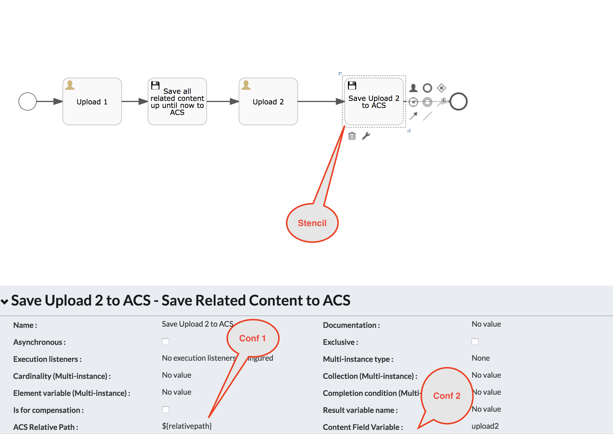
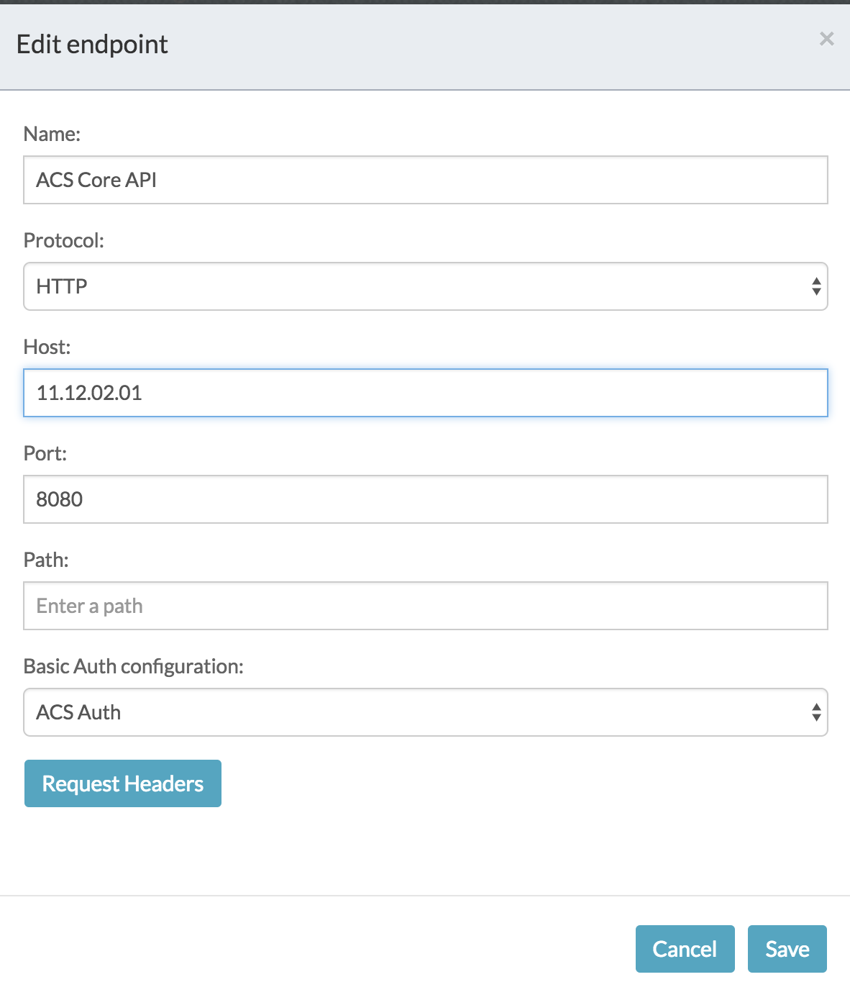

## An extension project containing a custom "Upload to Alfresco Content Service(ACS)" BPMN Stencil

### Configuration options of stencil.

1. ACS Relative Path: relative path with respect to -root-. You can either pre-set the value in the model or it can be resolved through expression (eg: variable)
2. Content Field Variable: If left empty, all the related content will be uploaded to the configured folder. If you require only a certain upload field's content in ACS, configure the "Field ID" in this property.

All the possible configuration options are shown in the example process that is part of "Test Upload Stencil App.zip". A sample configuration show below. 

### Deploy and Run Steps
1. Deploy the jars aps-acs-integration-utils-1.0.0-SNAPSHOT.jar & httpmime-4.3.5.jar (a dependency for the extension) activiti-app webapp's WEB-INF/lib folder
2. Import the "Test Upload Stencil App.zip" into your APS instance via the APS UI.
3. Configure a new endpoint named "ACS Core API" under IdentityManagement -> Tenants -> Endpoints. Example shown below 
4. Modify the process configuration to meet your needs and run the process end-end. If successful, all the files will be uploaded to ACS.

