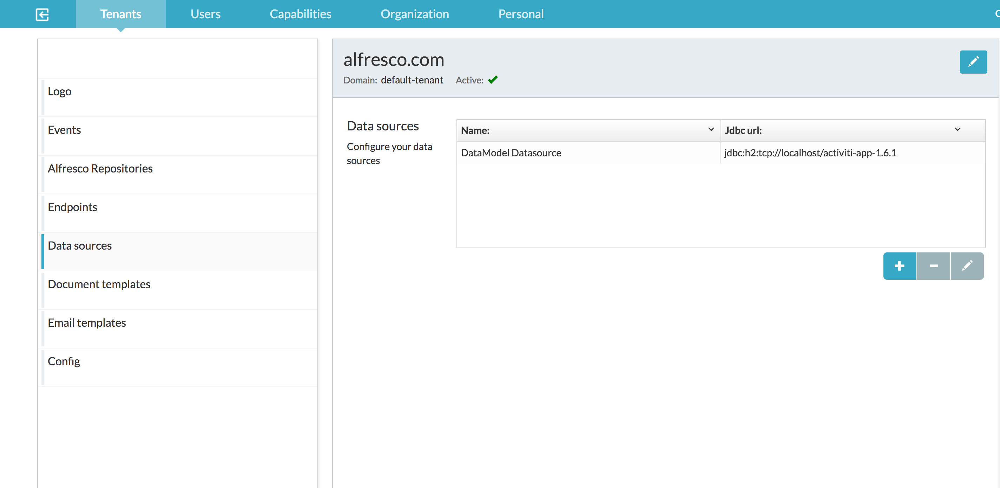
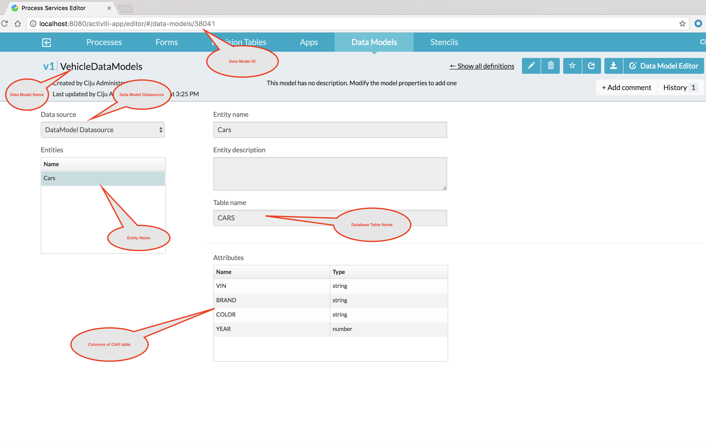
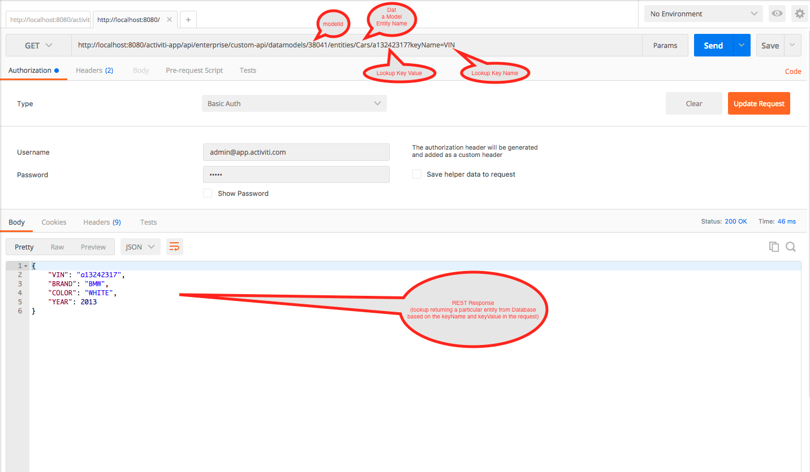
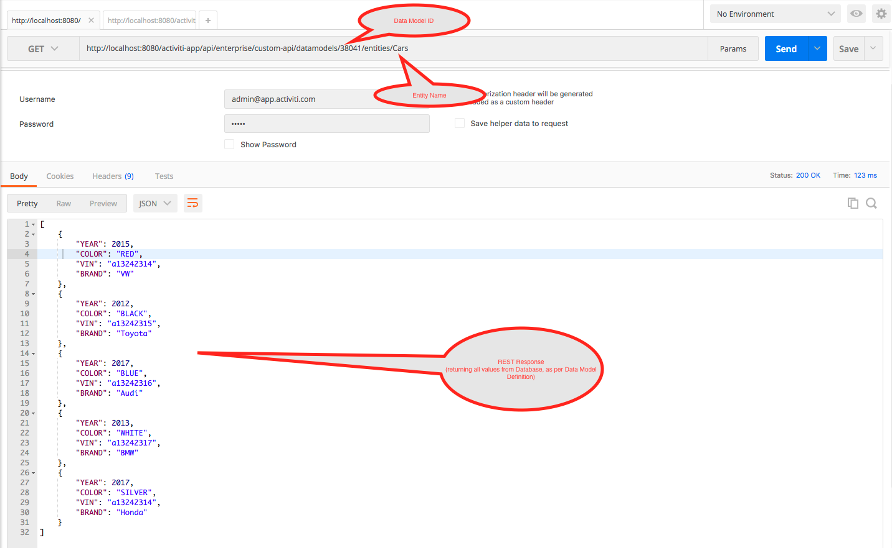
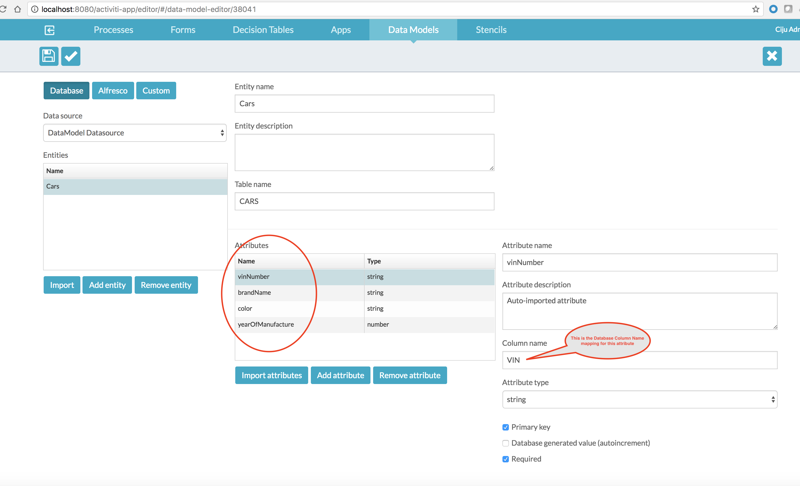
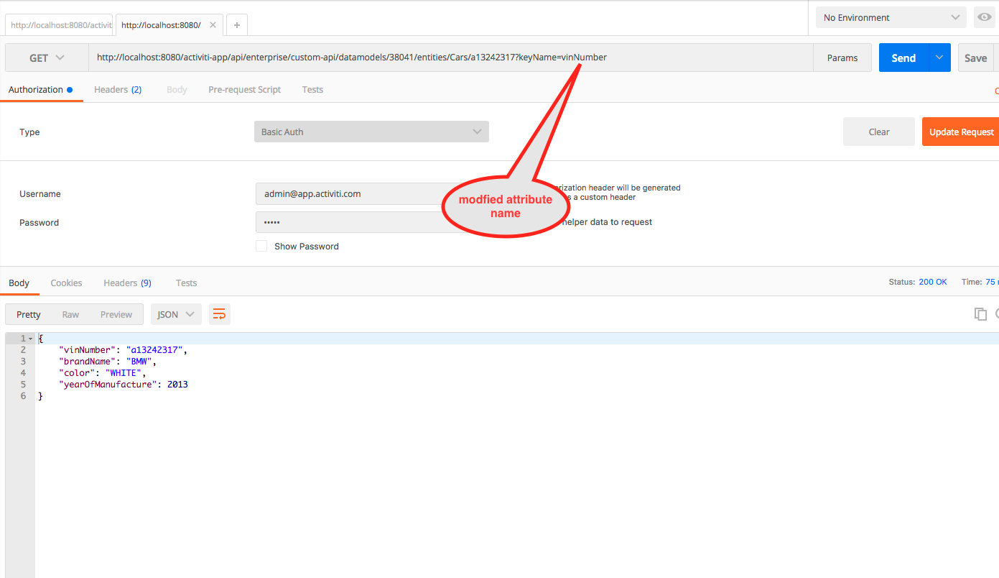
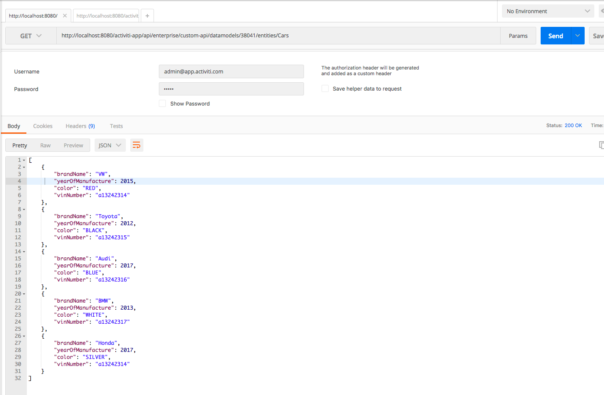

## A REST extension over database based Data Models in Alfresco Process Services

### Configuration & available REST APIs 

To configure this extension it is easy, all you have to do is place the aps-database-datamodel-rest-extension-1.0.0-SNAPSHOT.jar file in webapps/activiti-app/WEB-INF/lib directory and you will have the following REST APIs available over your database based data model definitions.

### Available REST APIs 

1. GET http://\<aps-host-name\>\:<aps-port-number\>/activiti-app/api/enterprise/custom-api/datamodels/\<data-model-id\>/entities/\<entity-name\>. This API will get all the entries from the database based on your data model definition. Basically this is the equivalent of "SELECT * FROM TABLE_NAME". One of the common use cases of this API is to show all the entries in a table as a drop down in a form field! Another use case is to display all the entries in a form table.

2. GET http://\<aps-host-name\>:\<aps-port-number\>/activiti-app/api/enterprise/custom-api/datamodels/\<data-model-id\>/entities/\<entity-name\>/\<keyValue\>?keyName=\<keyName\>. This is to get/lookup a row in the table using a where clause. Equivalent of "SELECT * FROM TABLE_NAME WHERE \<key name(DataModel Entity Attribute Name)\>=\<key value\>".

Since the APIs are under '/activiti-app/api/enterprise', they are secured using HTTP Basic Auth by default.

## An Example & Screenshots
Let me now show a simple example with few screenshots.
*	Step 1:	Create a data source configuration via ActivitiUI->Identity Management->Tenants->Data sources so that data models can be configured to use this connection to connect to the database. For more details on data models please refer [User Guide](http://docs.alfresco.com/process-services1.6/topics/data_models.html)

*	Step 2: Run the scripts in example/sample-datamodel-ddl-dml.sql against your database to create a lookup table and some sample data.

*	Step 3: Import the data model named "VehicleDataModels.json" in example directory of this project via ActivitiUI->App Designer->Data Models->Import Data Model

*	Step 4:	Using a REST API Tool ([Postman](https://www.getpostman.com/) in this example) invoke the new APIs.

* 	Step 5: If you look at the above screenshot, you can see that the fields/attributes in the REST response looks very DB-ish! Let's now beautify the REST response to make the response look a little REST-ish. All you have to do is edit the data model attribute names based on your choice of naming convention (eg: lower camel case in this example).

