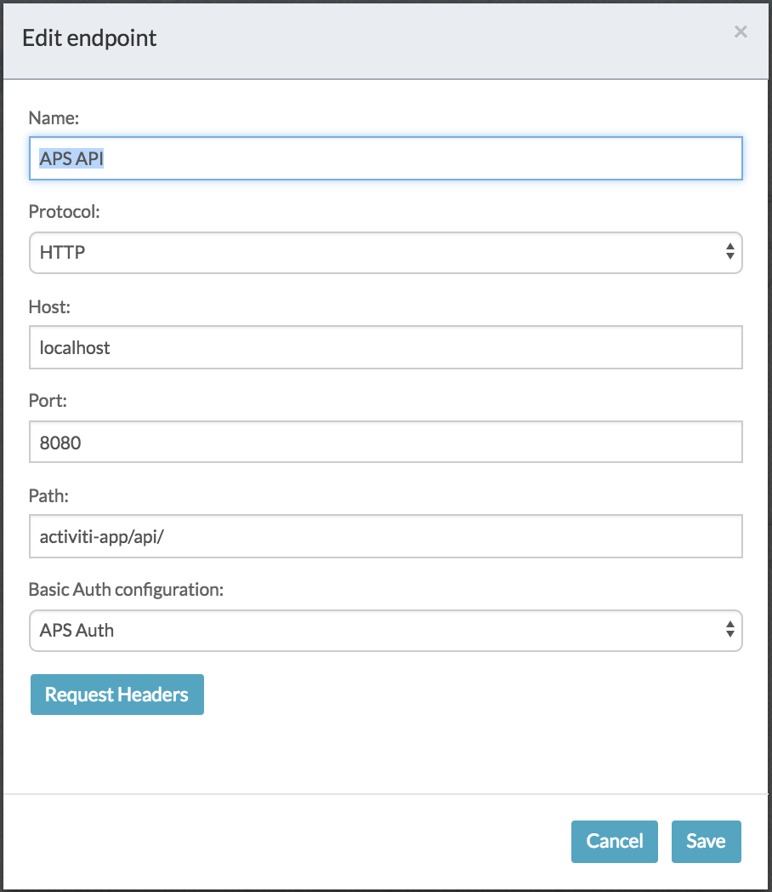
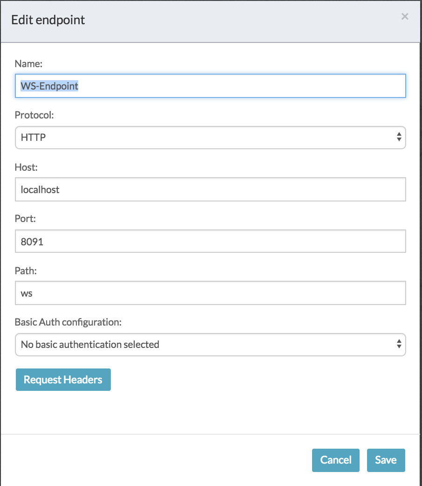
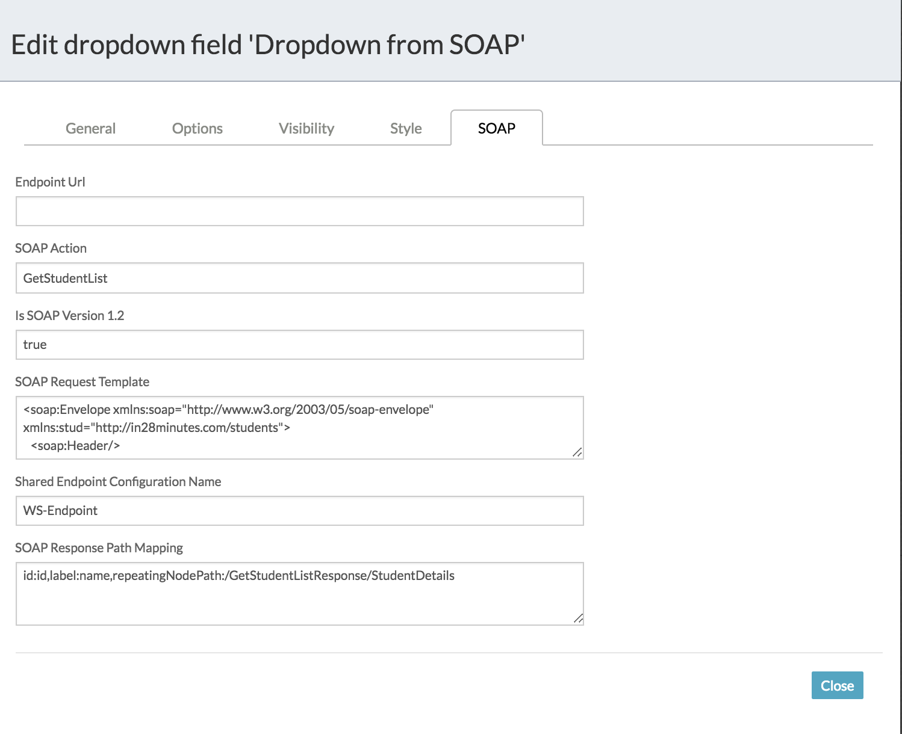
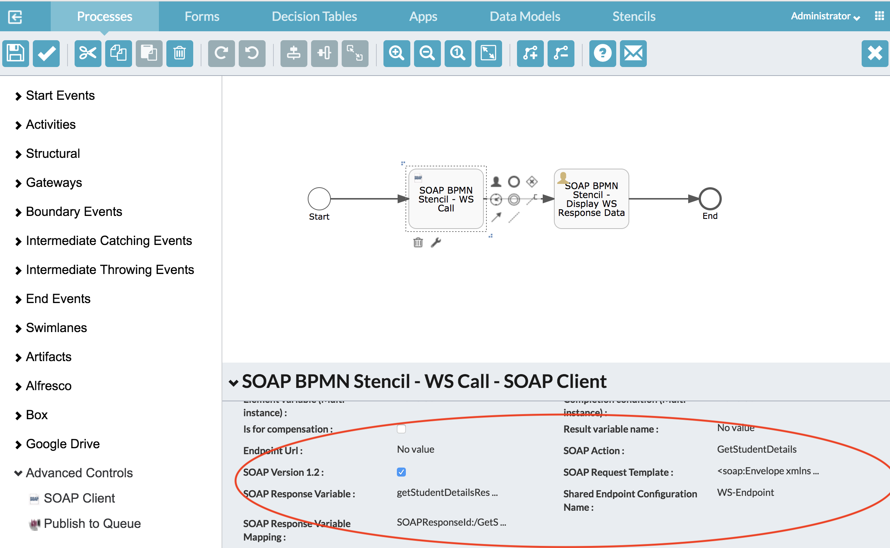
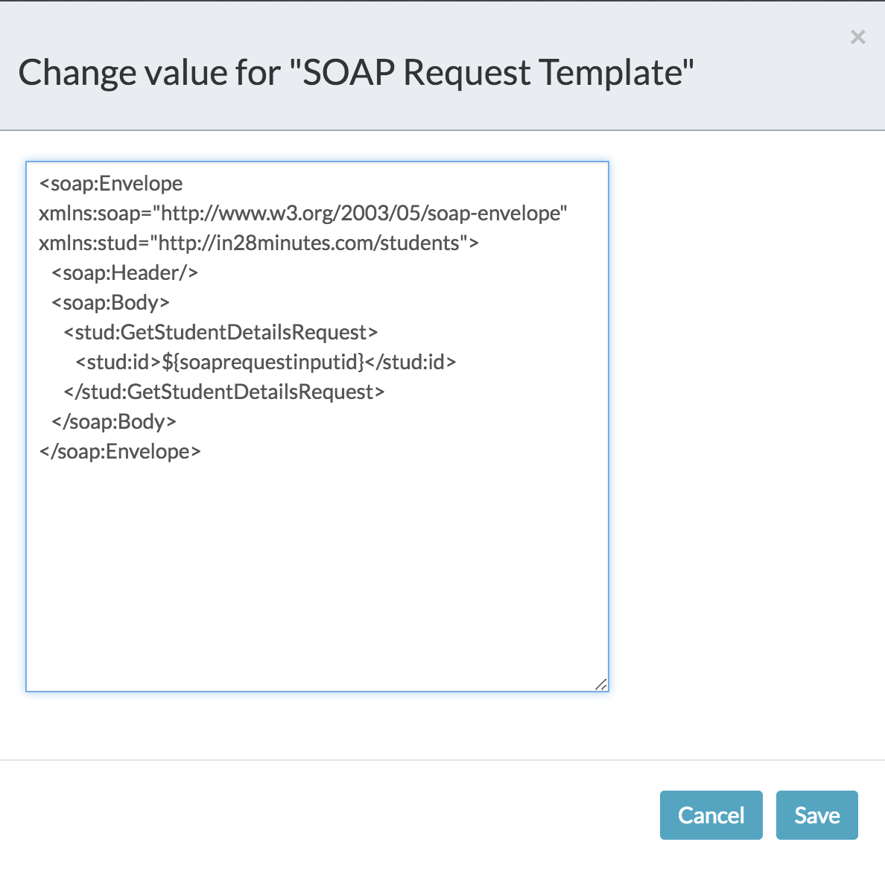

Utility  classes for building SOAP WS stencils (Form as well as BPMN).

#### Quick and dirty README below, until I write a proper README refer to the source code for more detail...

1. Place aps-soap-ws-extensions.jar in the APS classpath
2. Create two endpoints in APS as explained below.
	1. A new endpoint named "APS API" under IdentityManagement -> Tenants -> Endpoints. Conf shown below. We will use this endpoint to configure REST API calls against APS.
		 
	2. A new endpoint named "WS-Endpoint" under IdentityManagement -> Tenants -> Endpoints. Conf shown below. We will use this endpoint to configure SOAP calls.
		.
3. Import the App "aps-soap-ws-extensions.zip" into your APS instance via the APS UI.
4. Start the example webservice that is configured in this example using the command `java -jar student-service-soap-1.2.jar`. This is basically a spring-boot soap webservice example I found online, thanks to https://github.com/in28minutes/spring-boot-examples/tree/master/spring-boot-tutorial-soap-web-services. To check if the webservice is running, you can try going to this URL using your browser http://localhost:8091/ws/students.wsdl which will return the WSDL.

### Form Stencils Design
Extended the existing controls Typeahead, Dropdown and Radio button to fetch the list via a SOAP call. See form config screenshot below. On the server side, I built a REST API RESTProxyForSOAP.java which reads this SOAP config, makes the SOAP call and return the response in a JSON format based on the response mapping configured on the form field! The REST API call is configured in the "Options" tab of form control

### BPMN Stencil Design
Created a Java Delegate (SOAPConnector.java) which reads the config from the BPMN xml and makes the SOAP call. See config screenshot below: 
.

In both form & bpmn stencils, the soap request mapping is done using xml templates as shown below. The message template supports variable substitution using form and process data. On the server side, the variable substitution is implemented using freemarker libs which is already part of APS.

	

