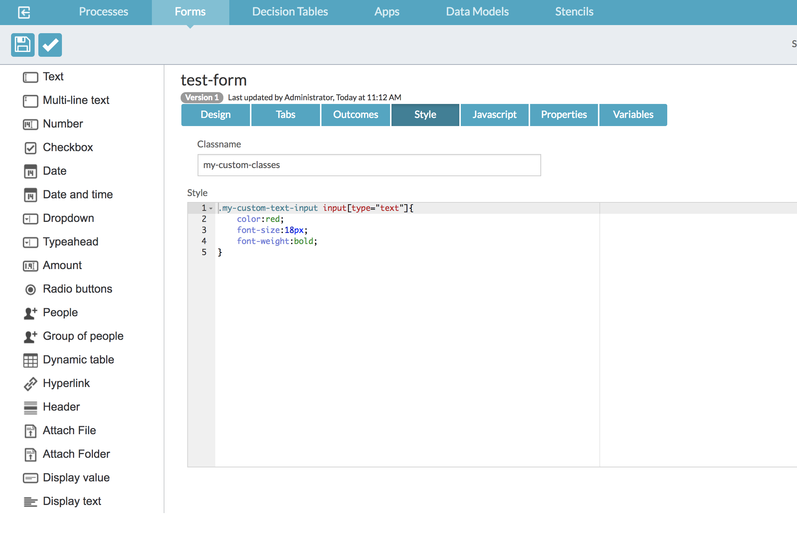
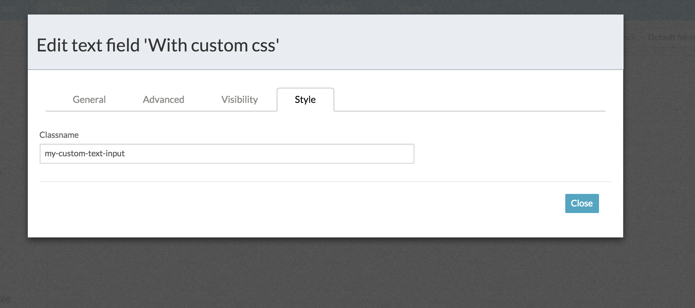
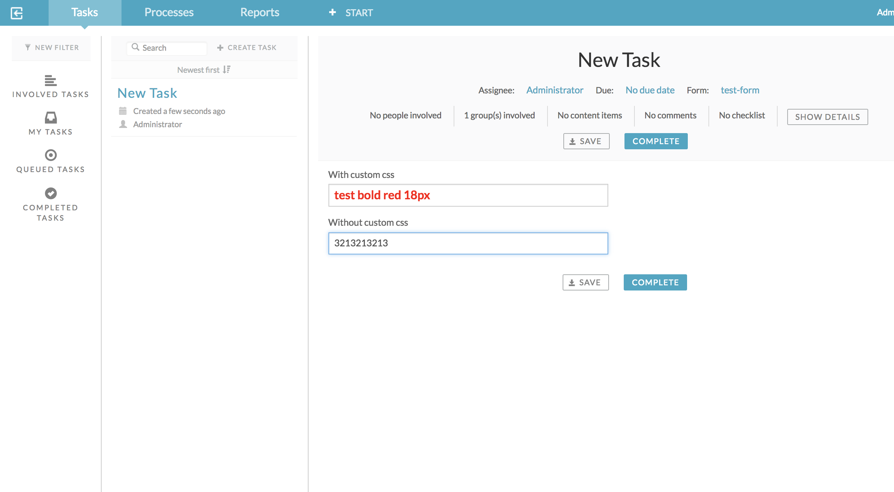

## Custom CSS on APS Forms fields

Solution originally provided on https://community.alfresco.com/message/826178-re-customizing-the-default-style-of-built-in-stencils-in-activiti-app-designer

## CSS Class

## Field Conf

## Runtime

