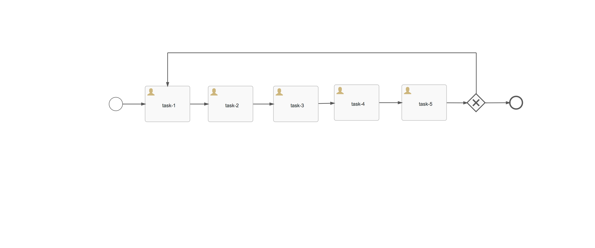

A simple task listener based approach to route the process to any of the 5 tasks in the following process upon a "Reject" task action! This "not so ideal workaround" is to reduce the complexity of a process diagram where you may need to route the process to any task in the process.

* Import the app export task-route.zip into APS
* Deploy aps-event-listener-based-task-routing-1.0-SNAPSHOT.jar to APS classpath
* Run the process & when you click on reject button on any of the tasks, the process will be progressed to the selected tasks (by automatically completing the other tasks in the path using an event listener)