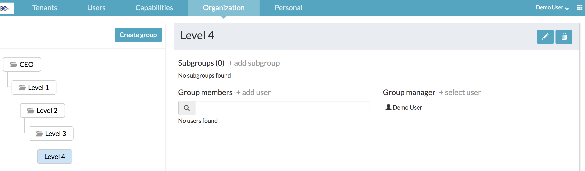
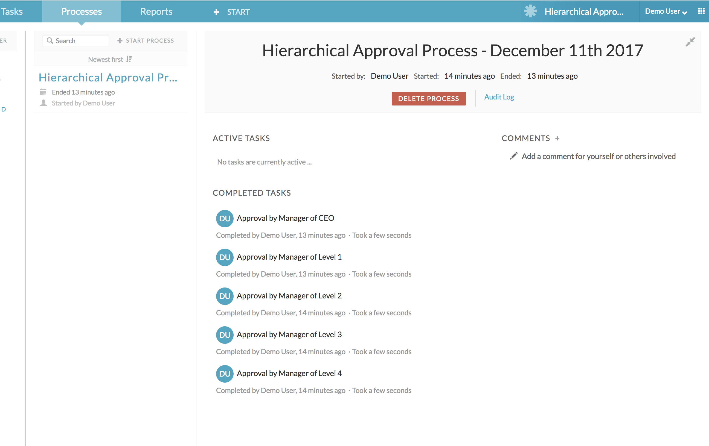

## A sample process showing how to route a user task through various group managers in a hierarchical way.

The zip archive file available in this folder is an “App” export exported from APS 1.7.0. To use this example, you will need to import them via App Designer -> Apps -> Import App. Once the “App” is successfully imported, run it to see this example in action!

Pre-requisites

Create a bunch of groups in a parent/child hierarchy as shown below

When you run the process, you will notice that an approval task is created in a sequential manner to the group managers all the way up to the top level group CEO! A runtime screenshot given below

