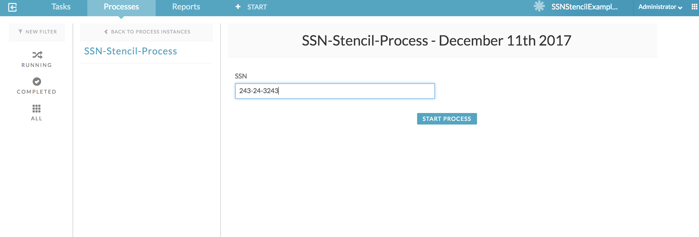
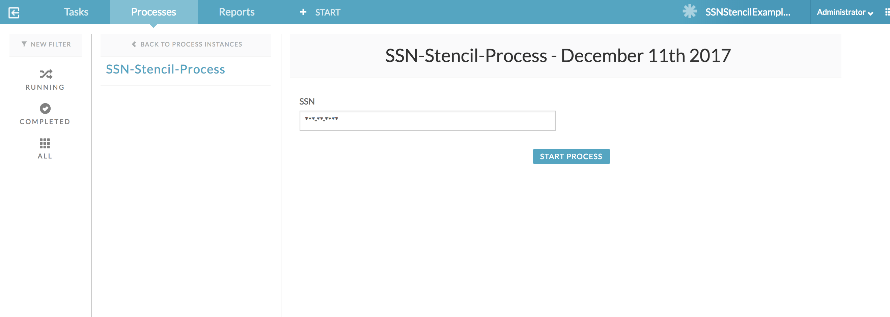
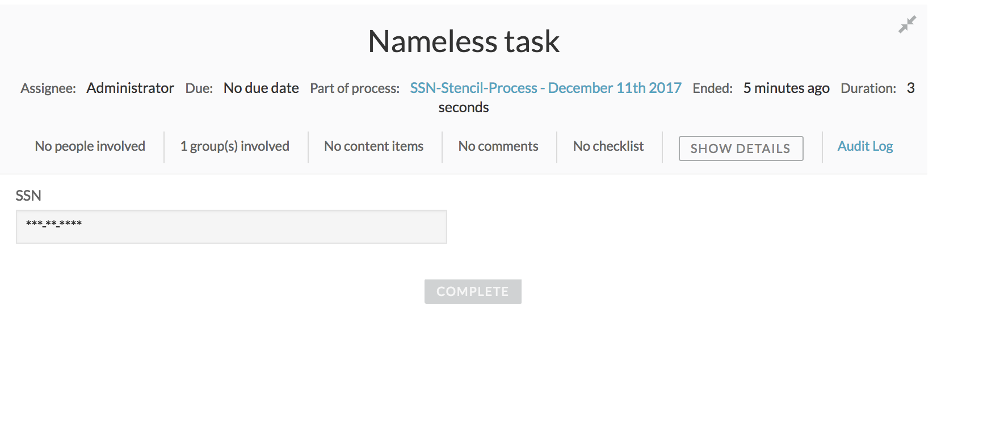

## SSN Field with Input Mask

The zip archive file available in this folder is an “App” export exported from APS 1.7.0. To use this example, you will need to import them via App Designer (Kickstart App) -> Apps -> Import App. Once the “App” is successfully imported, the stencil along with an example process and form will also get imported which will make it easy for you to see this examples in action!

Note: The import may not work with APS versions below 1.7.0.

## Edit mode with focus on the field

## Edit mode when focus is not on the field

## Read-only view

